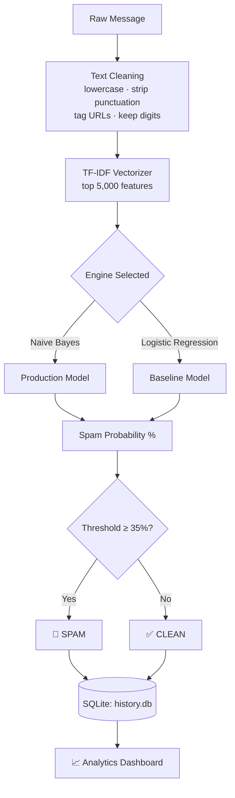

<div align="center">

# 🛡️ Spam Guard — AI-Powered Spam Detection Dashboard

A dual-engine Machine Learning system for real-time SMS/Email spam classification.


[🚀 Live Demo](https://spam-classifier-balushetty07.streamlit.app/) &nbsp;|&nbsp; [⚙️ Setup](#-run-locally) &nbsp;|&nbsp; [📖 How It Works](#-how-it-works)

</div>

<br>

## 📋 Table of Contents

- [Overview](#-overview)
- [Features](#-features)
- [How It Works](#-how-it-works)
- [Model Performance](#-model-performance)
- [Project Structure](#-project-structure)
- [Tech Stack](#-tech-stack)
- [Run Locally](#-run-locally)
- [Engineering Fixes](#-key-engineering-problems-solved)
- [Future Roadmap](#-future-roadmap)
- [Team](#-team)
- [References](#-references)

<br>

## 🎯 Overview

Traditional spam filters rely on static keyword blocklists — a losing battle, since attackers constantly reword their messages. **Spam Guard** takes a statistical approach instead: it mathematically learns the *patterns* of spam from thousands of real SMS messages, so it can catch brand-new spam it has never seen before.

Built as the AI/ML Open Elective capstone project for the **2024 ECE batch at SJCE, Mysore**, this is a full production-style dashboard with persistent storage, live analytics, and a selectable dual-model inference engine.

<br>

## ✨ Features

- 🧠 **Dual-Engine Inference** — switch live between Naive Bayes and Logistic Regression
- 📊 **Probability Scoring** — exact spam-confidence percentage, not just a label
- 🔗 **Link Intelligence** — suspicious URLs auto-detected and weighted as a threat signal
- 🗄️ **Persistent Logging** — every scan saved to a local SQLite database (`history.db`)
- 📈 **Analytics Dashboard** — total scans, threats blocked, clean passed, trend chart
- 🚩 **Human-in-the-loop** — flag misclassified messages for future retraining
- 🕒 **Session History** — rolling view of recent scans on the main screen
- 🎨 **Polished UI** — custom glassmorphism dark theme

<br>

## 🧠 How It Works

**Pipeline:**



1. **Raw message** is submitted through the dashboard
2. **Text cleaning** — lowercase, strip punctuation, tag URLs as `suspiciouslink`, preserve digits (amounts/codes are strong spam signals)
3. **TF-IDF vectorization** — converts cleaned text into the top 5,000 weighted numeric features
4. **Model inference** — routed to either Naive Bayes (production default) or Logistic Regression, selectable at runtime
5. **Thresholding** — spam probability compared against a tuned **35%** cutoff → `SPAM 🚨` or `CLEAN ✅`
6. **Logging** — result saved to SQLite and reflected instantly in the Analytics Dashboard

**Preprocessing code:**

```python
def clean_text(text):
    text = text.lower()
    text = re.sub(r'https?://\S+', ' suspiciouslink ', text)
    text = re.sub(r'[^a-z0-9\s]', '', text)   # digits kept — strong spam signal
    return text
```

**Dataset:** [SMS Spam Collection Dataset](https://www.kaggle.com/datasets/uciml/sms-spam-collection-dataset) (UCI/Kaggle) — 5,574 labeled messages, ~87% ham / ~13% spam.

**Models:**
- **Multinomial Naive Bayes** *(production default)* — fast, lightweight, `class_prior=[0.45, 0.55]` to correct class-imbalance bias
- **Logistic Regression** *(alternate engine)* — `class_weight='balanced'`, used as a comparative baseline

**Dashboard pages:** **Classifier** (live inference) · **Database** (SQL-backed analytics + misclassification flagging) · **About** (project rationale & benchmarks)

<br>

## 📊 Model Performance

| Model | Accuracy | Precision (Spam) | Recall (Spam) | F1-Score (Spam) |
|---|---|---|---|---|
| **Naive Bayes** ✅ | **98.83%** | 1.00 | 0.94 | 0.97 |
| Logistic Regression | ~96% | — | — | — |

**Confusion Matrix — Naive Bayes**

| | Predicted Ham | Predicted Spam |
|---|---|---|
| **Actual Ham** | 965 | 0 |
| **Actual Spam** | 9 | 141 |

<br>

## 🗂️ Project Structure

```
spam-classifier/
├── app.py            # Streamlit dashboard — UI, dual-engine inference, SQLite logging, analytics
├── classifier.py      # ML pipeline — preprocessing, training, evaluation, model export
├── requirements.txt    # Python dependencies
├── spam_model.pkl      # Trained Naive Bayes model
├── lr_model.pkl        # Trained Logistic Regression model
├── vectorizer.pkl      # Fitted TF-IDF vectorizer
├── history.db          # SQLite database (auto-generated on first run)
└── .gitignore
```

> `spam.csv` is excluded from the repo (size) — download it from [Kaggle](https://www.kaggle.com/datasets/uciml/sms-spam-collection-dataset) to retrain.

<br>

## ⚙️ Tech Stack

| Layer | Tools |
|---|---|
| **Language** | Python 3.8+ |
| **ML / NLP** | scikit-learn (TF-IDF, Naive Bayes, Logistic Regression) |
| **Data** | Pandas |
| **Storage** | SQLite3 |
| **Frontend** | Streamlit (custom CSS, glassmorphism theme) |
| **Serialization** | Pickle |
| **Text Processing** | Regex (`re`) |

<br>

## 🚀 Run Locally

```bash
# 1. Clone the repository
git clone https://github.com/balushetty07/spam-classifier.git
cd spam-classifier

# 2. Install dependencies
pip install -r requirements.txt

# 3. (Optional) Retrain the model — requires spam.csv from Kaggle
python classifier.py

# 4. Launch the app
streamlit run app.py
```

Then open **`http://localhost:8501`** in your browser 🎉

<br>

## 💡 Key Engineering Problems Solved

| Problem | Root Cause | Fix Applied |
|---|---|---|
| Spam flagged as safe | Numbers stripped during cleaning | Regex changed `[^a-z\s]` → `[^a-z0-9\s]` |
| Model biased toward "safe" | Dataset is 87% ham | `class_prior=[0.45, 0.55]` in Naive Bayes |
| Borderline spam missed | Default 50% threshold too high | Custom **35%** decision threshold |
| Links not learned | URLs untagged pre-vectorization | `suspiciouslink` token injection |
| No visibility into history | No persistence layer | SQLite logging + live analytics dashboard |

<br>

## 🔮 Future Roadmap

- [ ] Deep learning upgrade (LSTM / BERT)
- [ ] Multilingual spam detection
- [ ] Real phishing-URL verification (beyond pattern tagging)
- [ ] Live email/SMS API integration
- [ ] Lightweight quantized model for embedded/IoT deployment

<br>

## 👨‍💻 Team

| Name | Role |
|---|---|
| **Balu S** | Main Developer — ML pipeline, dashboard, deployment |
| **Vijaya Kumar** | Development Support |
| **Shivaraj PM** | Development Support |

**Sri Jayachamarajendra College of Engineering (SJCE), Mysore**
Dept. of Electronics & Communication Engineering · 4th Semester, 2024 Batch · AI/ML Open Elective

<br>

## 📚 References

1. Almeida et al., *Contributions to the Study of SMS Spam Filtering*, ACM 2011
2. Joachims T., *Text Categorization with Support Vector Machines*, ECML 1998
3. Pedregosa et al., *Scikit-learn: Machine Learning in Python*, JMLR 2011
4. [SMS Spam Collection Dataset — UCI ML Repository](https://archive.ics.uci.edu/ml/datasets/sms+spam+collection)
5. Jurafsky & Martin, *Speech and Language Processing*, Pearson 2021

<br>

<div align="center">

Made with ❤️ by **Balu S** · SJCE Mysore

</div>